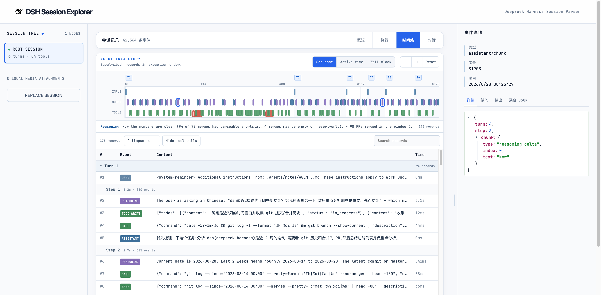
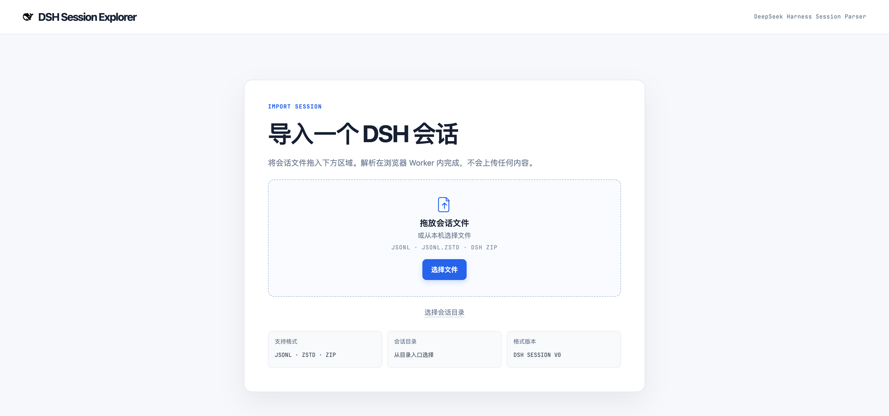
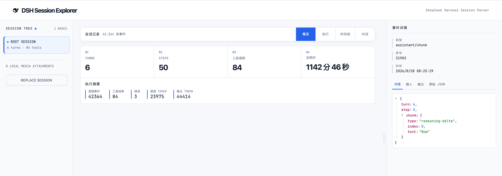
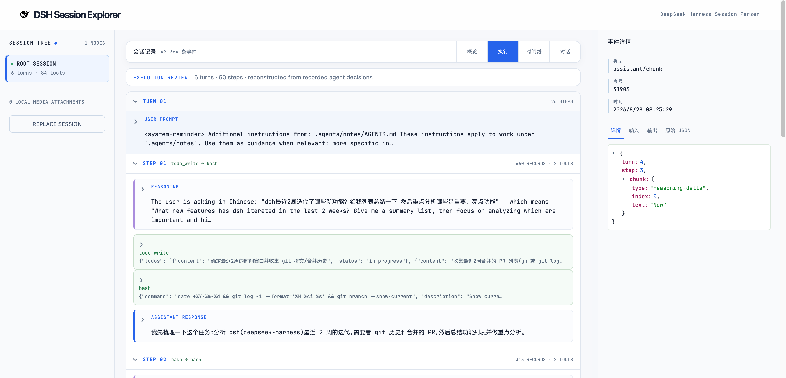

# DSH Session Log Explorer

[English](README.md) | 中文

这是一个在浏览器本地运行的 [DeepSeek Harness](https://github.com/deepseek-ai/deepseek-harness) 会话日志查看器。它把导出的 JSONL 工件还原为可阅读的执行叙事、可检查的事件记录，以及带时间信息的 Agent 轨迹；会话内容不会发送到服务器。

> 本项目独立开发，非 DeepSeek 官方项目，也不代表 DeepSeek 的认可或支持。



## 它能帮助你学习什么

- 按 Agent 的已记录决策还原 turn 与 step，无需直接阅读原始 chunk 事件。
- 在同一工作区串联工具调用、推理、模型回复、错误与对应的原始事件。
- 对比执行顺序、已记录的活跃执行时间，以及保留等待间隔的 wall-clock 时间。
- 以可折叠 JSON 树检查事件数据，或复制原始 JSON 记录。
- 在本地打开导出的会话目录、JSONL、Zstandard 压缩 JSONL 和 DSH ZIP。

## 截图

### 本地导入



### 总览会话



### 阅读执行叙事



### 学习 Agent 轨迹


## 隐私

文件由浏览器 Worker 解析，只保留在当前浏览器标签页。应用没有服务端接口、云同步、分析埋点、会话编辑，也不会在刷新页面后保留会话内容。

## 支持的输入

- `session.jsonl`
- `session.jsonl.zstd`
- 会话目录，包括 `subagents/` 与 `media/`
- DSH 会话导出的 ZIP

解析器支持 session format version `0`，并会将打包的文本、推理和工具调用 chunk 行展开为逻辑事件。

## 本地运行

需要 Node.js 20+ 与 pnpm。

```sh
pnpm install
pnpm dev
```

打开 Vite 输出的本地地址。生产构建与测试：

```sh
pnpm build
pnpm test
```

## 范围

该工具用于本地学习和调试导出的日志。它不连接运行中的 DSH Agent、不修改会话、不提供实时 tail，也不会把独立子 Agent 日志按时间戳伪造成一条全局因果序列。

## 许可证与声明

项目代码采用 [MIT License](LICENSE)。DeepSeek Harness favicon 的来源说明与独立项目声明见 [NOTICE.md](NOTICE.md)。
