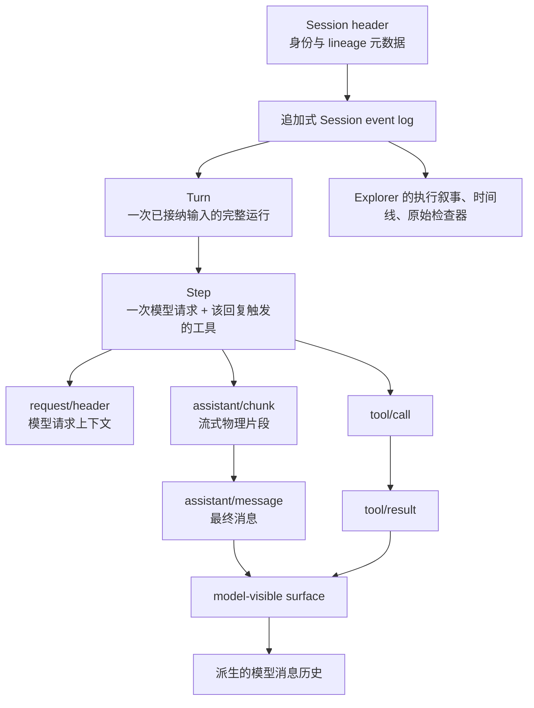

# 如何读一份 DSH Session Log

这篇不是 DSH 的全量事件 API 参考，而是 DSH Session Explorer 的阅读地图。它只解释会改变“如何理解这份日志”的术语。

如果你刚开始，请按这个顺序阅读：**Session → Turn → Step → 请求上下文 → 模型输出与工具 → surface/compaction → fork 与 subagent**。

## 先建立心智模型

DSH 的 Session 是追加式事件日志，不是一个只保存聊天消息的数组。消息历史、请求上下文和 UI 都从同一份日志派生。

## 1. Session、Turn、Step、Event

| 术语 | 一句话定义 | Explorer 中怎么读 |
| --- | --- | --- |
| **Session** | 一次可持久化、可回放的 Agent 交互日志。 | 左侧 Session Tree 的一个节点。 |
| **Turn** | 一次被 Agent 接纳的输入排空过程；模型与工具停止后结束。 | `TURN 01`、`TURN 02`。一个 Turn 可以没有 Step。 |
| **Step** | 一次模型请求，以及该回复触发的工具执行。 | `STEP 01` 内的 reasoning、tool calls 和 assistant response。 |
| **SessionEvent** | 日志里的不可变、有序记录，带 `seq`、`time`、`type` 和 `data`。 | 右侧原始检查器中的一条事件。 |

`seq` 只表示**同一 Session 内**的单调顺序；它不是跨 subagent 的全局因果序列。`time` 是事件记录时间；两个时间戳之差可以用于观察等待，但不是每种操作都精确的执行时长。

## 2. 原始记录、流式 chunk 与逻辑视图

一份导出文件的物理行数、解码后的事件数、Explorer 的逻辑卡片数通常不同：

| 层级 | 例子 | 为什么数量不同 |
| --- | --- | --- |
| 存储记录 | JSONL 行、压缩 chunk row | 一行可能打包多个事件。 |
| 原始事件 | `assistant/chunk` | 流式输出会产生很多 token 级片段。 |
| 逻辑消息 | `assistant/message` | 一次 Step 的最终可见输出与 token 用量。 |
| Explorer 视图 | reasoning、tool card、response | 为学习 Agent 决策而聚合的可读投影。 |

因此，“42,364 条事件”并不表示 Agent 做了 42,364 次决策。想理解决策时先看执行视图；想核对解析时再看右侧原始 JSON。

### `assistant/chunk` 与 `assistant/message`

- `assistant/chunk` 是流式过程中的物理片段。它可能是 reasoning delta、文本 delta 或工具调用片段。
- `assistant/message` 是一个 Step 的最终组装消息，也是模型历史使用的消息；其中可附带 token usage 和 `interrupted: true`。

Explorer 将 reasoning chunk 聚合成一个 reasoning block，并将最终 assistant message 作为模型回复展示。

## 3. 用户消息不一定来自人

`user/message` 是模型可见的 user-role 消息。它可能是：

- 人类直接输入；
- 插件注入的上下文，例如仓库 `AGENTS.md`、文件变化或技能内容；
- goal continuation 等系统驱动输入。

所以在执行视图看到 `<system-reminder>` 或来自 plugin 的内容，不代表用户手动输入了那段文字。请结合原始事件的 `source` 字段判断来源。

## 4. 请求上下文与 Epoch

一次模型请求除了消息历史外，还依赖模型配置、最终 system prompt 和工具 schema。DSH 用 `request/header` 保存这份完整快照；Explorer 把它显示为 **Model Request Context** 与 **EPOCH 01**。

详细说明见：[DSH 请求上下文 Epoch](request-context-epochs.zh.md)。

最重要的规则是：`resume` 只表示新 Agent loop 在已有日志上发出首次请求，**不证明 system prompt 更新**。工具目录改变时，DSH 会再次记录完整 header，因此相同 system prompt 可能再次出现。

## 5. 工具调用：请求与结果是两件事

| 事件 | 含义 | Explorer 呈现 |
| --- | --- | --- |
| `tool/call` | 模型输出了工具名、`callId` 与原始参数 JSON。 | 工具卡片的 input。 |
| `tool/result` | 该 `callId` 的模型可见结果；可能带错误身份和工具私有 `meta`。 | 工具卡片的 result 或 error output。 |

工具参数是模型原样输出的 JSON 字符串；Explorer 使用树状 JSON 方便检查，但原始 JSON 标签页才是最终核对依据。

## 6. surface：模型历史不是原始事件列表

DSH 只有三种事件能进入模型可见的有序 surface：`user/message`、`assistant/message`、`tool/result`。

- `surfaceOp: "append"`：消息按正常顺序加入模型历史。
- `surfaceOp: { op: "replace", start, end }`：一条新消息替换 surface 上的旧范围。
- `sourceEventSeqs`：该逻辑消息引用哪些早期原始事件，例如最终 assistant message 引用生成它的 chunk。

这解释了一个重要差别：**原始日志保留历史，模型看到的历史可以被替换。** Explorer 的执行叙事偏向“发生过什么”；模型历史则遵循 surface 的替换规则。

## 7. Compaction：摘要替换，不是删除日志

当上下文过长时，DSH 可以执行 compaction：

1. `compaction/start` 打开一次摘要事务；
2. `compaction/summary` 记录摘要、输入范围和生成摘要的模型信息；
3. 一个带 `surfaceOp.replace` 的 `user/message` 在模型可见 surface 中替换旧范围；
4. `compaction/end` 结束事务。

旧事件仍留在原始日志中；被替换的是模型之后读取的 surface 节点。`shadowedRange` 和 `shadowedSeqs` 指的是被摘要遮蔽的**surface 节点**，不能简单按数值 `seq` 范围理解。

## 8. Fork、seed 与 subagent

Session header 中几个字段会说明日志从哪里来：

| 字段 / 事件 | 含义 |
| --- | --- |
| `parentSession` | 本 Session 从哪一个父 Session 的历史 seed 出来。 |
| `seedLength` | 开头多少条事件来自继承历史，而不是本次 live work。 |
| `session/end-seed` | seed 历史与本次 live 生命周期的边界。 |
| `origin: "subagent"` / `delegationDepth` | 该 Session 是 subagent child，以及持久化的委派深度。 |
| `subagent/descriptor` | 子 Agent 是 one-shot 还是 continuable，以及恢复所需的组合信息。 |

子 Agent 是独立 Session，不应把父子日志按时间戳拼成一条“全局因果链”。Explorer 的 Session Tree 保留这种树关系；阅读时先选择一个节点，再理解它自己的 Turn/Step。

## 9. Turn 为什么结束

查看 `turn/end.data.reason` 可以区分：

| 原因 | 解读 |
| --- | --- |
| `completed` | 正常结束。 |
| `aborted` | 被用户、父 Agent、hook 或 dispose 取消。 |
| `blocked` | 终止策略阻止继续。 |
| `error` | 运行失败，检查结构化错误。 |
| `max-tokens` | 某 Step 触及输出 token 上限。 |
| `interrupted` | 持久化层在重新加载时关闭了崩溃遗留的 Turn；已有事件仍然有效。 |

不要把 `interrupted` 当作“模型返回了中断错误”。它主要说明 lifecycle 在存储恢复时发现了未闭合 Turn。

## 推荐的 Explorer 阅读路径

1. **概览**：先判断 Session 的 Turn/Step/工具/耗时规模。
2. **执行**：按 Step 阅读模型如何推理、调用工具和产出回复；必要时查看生效的 context epoch。
3. **时间线**：观察请求上下文、reasoning、工具和等待的相对次序。
4. **对话**：快速查看人类、插件与模型的可读内容。
5. **右侧检查器**：遇到“为什么”时回到原始事件、输入、输出和原始 JSON。

原始日志可能包含 prompt、路径、命令参数、工具输出和媒体引用。Explorer 保持本地解析；分享截图或导出片段前仍应自行检查敏感内容。

## 源码依据与边界

本文依据 DSH 的 Session 类型、surface 投影、compaction 和 subagent descriptor 源码，以及当前 Explorer 支持的 Session v0 导出格式。上游术语和事件集合会演进；遇到不认识的 required event，不应假设可以安全忽略，应该先回到原始 JSON 和对应 DSH 版本核对。
